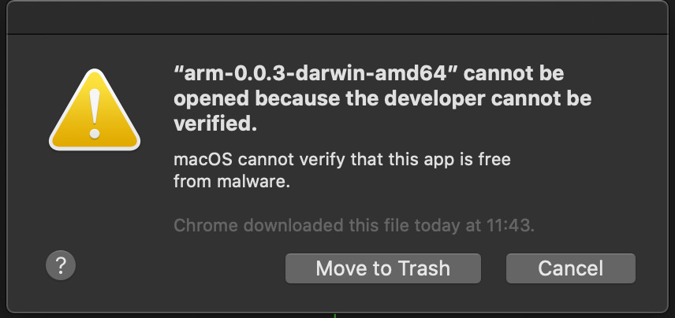
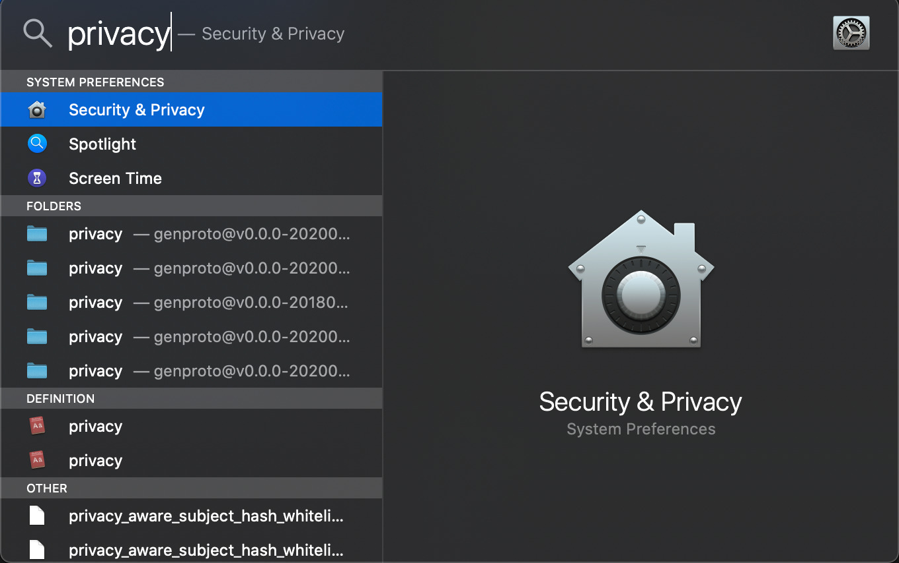
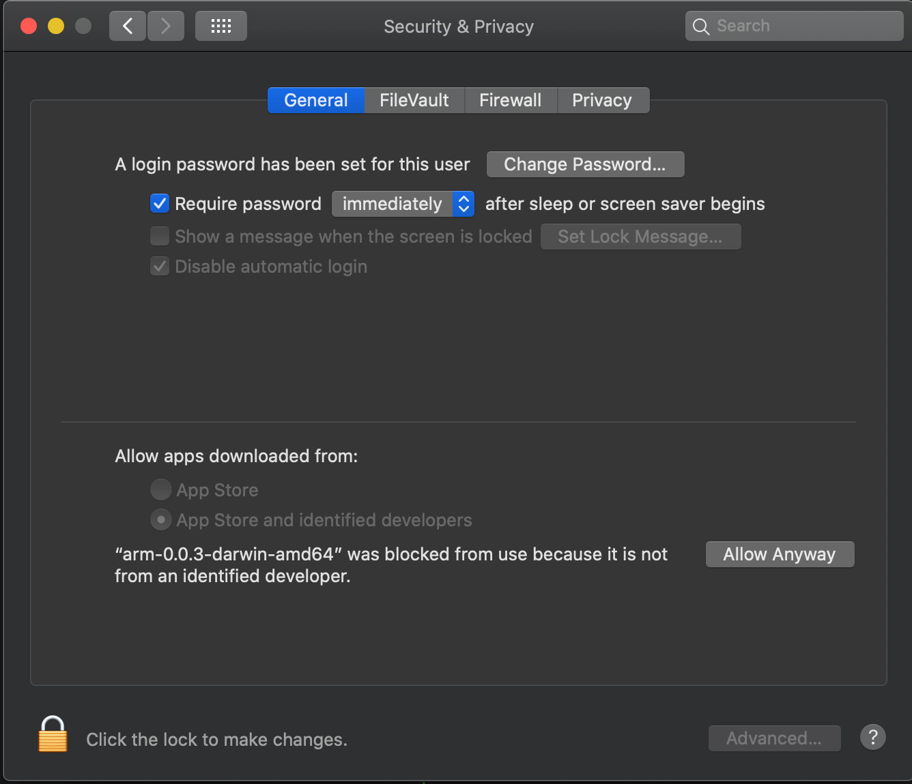
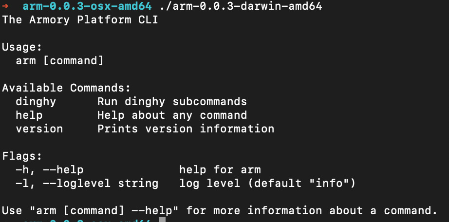
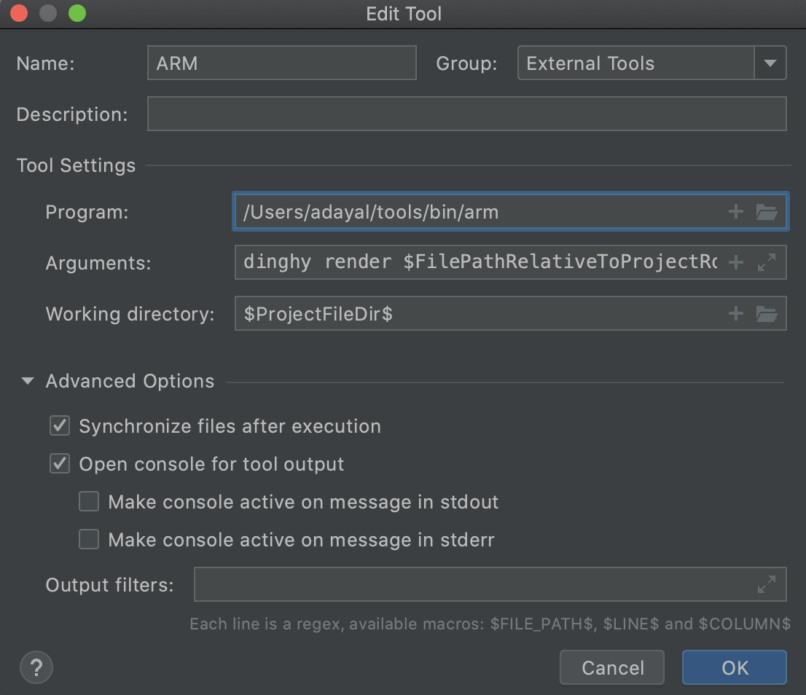
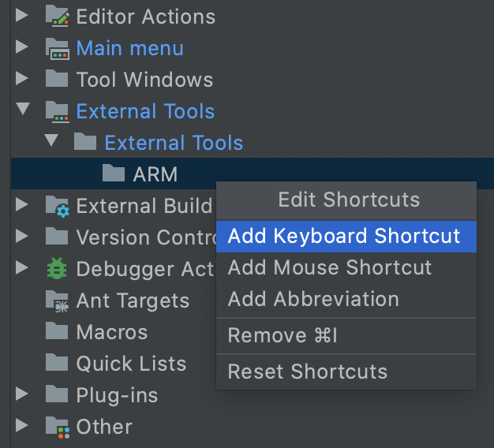

[](https://coveralls.io/github/armory-io/arm?branch=master)

# Armory CLI
Armory CLI or better know as `arm cli` is a tool that let you render dinghyfiles offline. You need to specify the dinghyfiles, modules and rawdata depending of the content of the dinghyfile to be rendered.

- [Armory CLI](#armory-cli)
  - [Docker Image](#docker-image)
  - [Arm installation](#arm-installation)
      - [Mac OS](#mac-os)
  - [IntelliJ Integration](#intellij-integration)
  - [Usage](#usage)
      - [Example](#example)

## Docker Image

There's a docker image for arm-cli, you can find it in [Docker Hub](https://hub.docker.com/r/armory/arm-cli). In order to use it you can:
```
docker pull armory/arm-cli:latest
docker run -it armory/arm-cli /bin/sh
```
And then in shell you can just execute ``arm`` command.
```
/ # arm
The Armory Platform CLI

Usage:
  arm [command]

Available Commands:
  dinghy      Run dinghy subcommands
  help        Help about any command
  version     Prints version information

Flags:
  -h, --help              help for arm
  -l, --loglevel string   log level (default "info")

Use "arm [command] --help" for more information about a command.
```

## Arm installation

The Armory CLI

To use this you can download the binaries fom the [release section](https://github.com/armory-io/arm/releases) and unzip the files depending on your OS.

You can add the tool to your path by doing:

```bash
ln -sf $PWD/arm /usr/local/bin/arm  
```

For Arch Linux based distributions it is available on the [AUR](https://aur.archlinux.org/packages/arm). Using your AUR helper of choice such as [yay](https://github.com/Jguer/yay).

```bash
yay -S arm
```

To use it just type arm in your console(if you added it to your path) or execute arm-cli directly.


```bash
➜  arm-1.0.0-osx-amd64 ./arm-1.0.0-darwin-amd64
The Armory Platform CLI

Usage:
  arm [command]

Available Commands:
  dinghy      Run dinghy subcommands
  help        Help about any command
  version     Prints version information

Flags:
  -h, --help              help for arm
  -l, --loglevel string   log level (default "info")

Use "arm [command] --help" for more information about a command.
```

#### Mac OS
Since arm-cli is not signed you may receive a couple of messages regarding security. To execute the binaries you need to:

1. When you execute arm-cli on the console you may see this message.



2. Open Spotlight search in your Mac OS and search for Security & Privacy. 



3. Once you opened this option go to General Tab and you will see on the bottom a button to "Allow Anyway" pointing at the bin, click on it.
 
 

4. Once you click on it the button will dissapear.

5. Try to execute again the binary in your console and arm-cli should be working.

 

## IntelliJ Integration

The CLI can be configured to run within IntelliJ. This allows you to validate
pipelines being edited without having to switch context to a terminal.

1. Add the CLI as an External Tool

Open Preferences and navigate to Tools -> External Tools. Click on the "+"
button to add a new configuration with the following values:

- Program: path to where the CLI is installed
- Arguments: ```dinghy render $FilePathRelativeToProjectRoot$ --modules <directory where templates repository checked out locally>```
- Working directory: ```$ProjectFileDir$```

  

2. Bind the CLI to a shortcut

In Preferences nagivate to Keymap. Expand "External Tools" and add a Keyboard
shortcut for the CLI.

  

3. Run CLI on open dinghyfile

When editing a dinghyfile you can invoke the CLI using the keyboard shortcut.
The CLI will run against the open dinghyfile being edited.

## Usage
Both the Dinghyfile and module repo must be available locally, there is an example folder build in the release zip file. For each file the command would be a little different depending if they use modules(other templating files) or rawdata (git push information). You can execute `dinghy render --help` anytime to get current supported parameters.

JSON Example files:

| Filename                                    | Module             | RawData            | Local Module       | Parameters                                                                                                                      |
|---------------------------------------------|--------------------|--------------------|--------------------|---------------------------------------------------------------------------------------------------------------------------------|
| dinghyfile_basic                            | :x:                | :x:                | :x:                | dinghy render ./examples/json/dinghyfile_basic                                                                                       |
| dinghyfile_rawdata                          | :x:                | :white_check_mark: | :x:                | dinghy render ./examples/json/dinghyfile_rawdata --rawdata ./examples/RawData.json                                                   |
| dinghyfile_conditionals                     | :x:                | :x:                | :x:                | dinghy render ./examples/json/dinghyfile_conditionals                                                                                |
| dinghyfile_globals                          | :white_check_mark: | :x:                | :x:                | dinghy render ./examples/json/dinghyfile_globals --modules ./examples/json/modules                                                        |
| dinghyfile_makeSlice                        | :white_check_mark: | :x:                | :x:                | dinghy render ./examples/json/dinghyfile_makeSlice --modules ./examples/json/modules                                                      |
| dinghyfile_makeSlice_conditional_rawdata    | :white_check_mark: | :white_check_mark: | :x:                | dinghy render ./examples/json/dinghyfile_makeSlice_conditional_rawdata --modules ./examples/json/modules --rawdata ./examples/RawData.json|
| dinghyfile_localmodule                      | :white_check_mark: | :x:                | :x:                | dinghy render ./examples/json/dinghyfile_localmodule --modules ./examples/json/modules                                                    |
| dinghyfile_pipelineID                       | :x:                | :x:                | :x:                | dinghy render ./examples/json/dinghyfile_pipelineID                                                                                  |
| dinghyfile_localmodule_parameter            | :white_check_mark: | :x:                | :white_check_mark: | dinghy render ./examples/json/dinghyfile_localmodule_parameter --modules ./examples/json/modules --local_modules ./                       |


YAML Example files:

| Filename                                    | Module             | RawData            | Local Module       | Parameters                                                                                                                      |
|---------------------------------------------|--------------------|--------------------|--------------------|---------------------------------------------------------------------------------------------------------------------------------|
| dinghyfile_basic                            | :x:                | :x:                | :x:                | dinghy render ./examples/yaml/dinghyfile_basic --type yaml                                                                                       |
| dinghyfile_rawdata                          | :x:                | :white_check_mark: | :x:                | dinghy render ./examples/yaml/dinghyfile_rawdata --rawdata ./examples/RawData.json --type yaml                                                  |
| dinghyfile_conditionals                     | :x:                | :x:                | :x:                | dinghy render ./examples/yaml/dinghyfile_conditionals --type yaml                                                                               |
| dinghyfile_globals                          | :white_check_mark: | :x:                | :x:                | dinghy render ./examples/yaml/dinghyfile_globals --modules ./examples/yaml/modules --type yaml                                                        |
| dinghyfile_makeSlice                        | :white_check_mark: | :x:                | :x:                | dinghy render ./examples/yaml/dinghyfile_makeSlice --modules ./examples/yaml/modules --type yaml                                                      |
| dinghyfile_makeSlice_conditional_rawdata    | :white_check_mark: | :white_check_mark: | :x:                | dinghy render ./examples/yaml/dinghyfile_makeSlice_conditional_rawdata --modules ./examples/yaml/modules --rawdata ./examples/RawData.json --type yaml|
| dinghyfile_localmodule                      | :white_check_mark: | :x:                | :x:                | dinghy render ./examples/yaml/dinghyfile_localmodule --modules ./examples/yaml/modules --type yaml                                                   |
| dinghyfile_pipelineID                       | :x:                | :x:                | :x:                | dinghy render ./examples/yaml/dinghyfile_pipelineID --type yaml                                                                                  |
| dinghyfile_localmodule_parameter            | :white_check_mark: | :x:                | :white_check_mark: | dinghy render ./examples/yaml/dinghyfile_localmodule_parameter --modules ./examples/yaml/modules --local_modules ./ --type yaml                       |


#### Example
```bash
$ arm dinghy render ./examples/dinghyfile_globals --modules ./examples/modules --rawdata ./examples/RawData.json --output ./testing
INFO[2020-05-08 15:49:29] Checking dinghyfile                          
INFO[2020-05-08 15:49:29] Reading rawdata file                         
INFO[2020-05-08 15:49:29] Parsing rawdata json                         
INFO[2020-05-08 15:49:29] Parsing dinghyfile                           
INFO[2020-05-08 15:49:29] Parsed dinghyfile                            
INFO[2020-05-08 15:49:29] Output:                                      
{
  "application": "global_vars",
  "globals": {
    "waitTime": "42",
    "waitname": "default-name"
  },
  "pipelines": [
    {
      "application": "global_vars",
      "name": "Made By Armory Pipeline Templates",
      "stages": [
        {
          "name": "default-name",
          "waitTime": "42",
          "type": "wait"
        },
        {
          "name": "overwrite-name",
          "waitTime": "100",
          "type": "wait"
        }
      ]
    }
  ]
}
INFO[2020-05-08 15:49:29] Final dinghyfile is a valid JSON Object. 
```

If final json file is valid you can see the message `Final dinghyfile is a valid JSON Object.`, this means that the final JSON object is valid.

